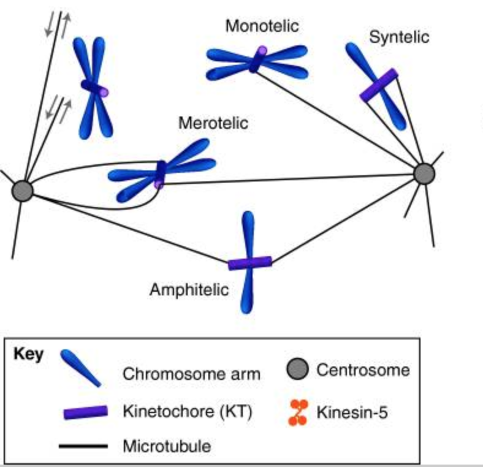
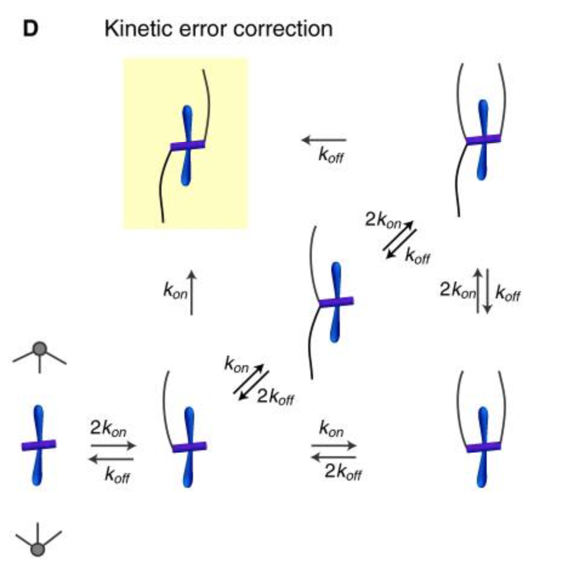
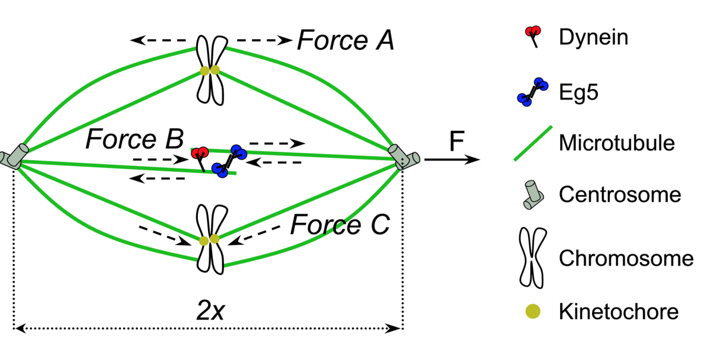

# mitotic_spindle
The previous model mimicking the dynein-Eg5 motor proteins effect on spindles considers a static kinetochore force. In reality, the net kinetochore force dynamically changes over time because an error-correction mechanism changes the number of Amphitelic and Merotelic chromosomes that collectively generate the net force. We modeled this dynamic change of forces using a system of Ordinary Differential Equations that characterize kinetic error corrections and integrate it into the dynein-Eg5 model.

Reference:
Ferenz NP, Paul R, Fagerstrom C, Mogilner A, Wadsworth P. Dynein antagonizes eg5 by crosslinking and sliding antiparallel microtubules. Curr Biol. 2009;19(21):1833-8.

Mogilner A, Craig E. Towards a quantitative understanding of mitotic spindle assembly and mechanics. J Cell Sci. 2010;123(Pt 20):3435-45.
